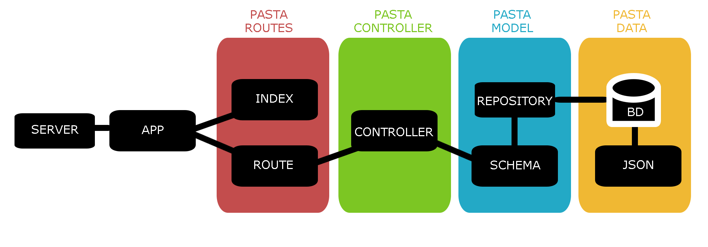

# API - Banco de Profissionais Negros
## Projeto de Conclusão de Curso

Projeto desenvolvido por Lidiane Angelo, aluna da turma de Back-End XP da [{Reprograma}](https://reprograma.com.br/).

## Descrição

   >Hoje, temos exatamente 3,8% de pessoas negras em cargos de liderança nas empresas brasileiras, de acordo com o estudo do Quero Bolsa. Criei uma API banco de profissionais negros, em todos os níveis, para que empresas e recrutadores possam ter o acesso à esses perfis e contratá-los. Esse banco de dados reúne todas as informações, facilitando o contato direto com esses profissionais
   >
   >O objetivo é iniciar com perfis da área de Comunicação, e futuramente expandir para outras áreas.
   >Personas: Profissionais negros, Recrutadores/ Hunters, Líderes/ Cargos de Liderança ou Influência.

   

# Sumário
=================
<!--ts-->
   * [Objetivos](#objetivos)
   * [Aprendizados](#aprendizados)
   * [Arquitetura Model View Controller](#arquitetura)
   * [Instalação](#instalação)
      * [Pre Requisitos](#pré-requisitos)
      * [Tecnologias](#tecnologias)
      * [Endpoints](#endpoints)
      * [Rotas](#rotas)
   * [Modelo teste: Postman ou Insomnia](#modelo-com-campos-obrigatórios-para-teste)
   * [Agradecimentos](#agradecimentos)
<!--te-->

=================
## Objetivos

- Mapeamento de perfil profissionais;
- Criar uma rede de contatos para que empresas tenham acesso direto;
- Influenciar na cadeia empresarial, contratando mais pessoas negras no mercado de trabalho.
- Promover a diversidade e inclusão de profissionais negros na Comunicação.

=================

## Aprendizados

Para a execução do projeto final, desenvolvemos uma API fundamentada no modelo que utiliza quatro operações básicas, que são:  CREATE (CRIAR), READ(LER-CONSULTA), UPDATE(ATUALIZAR) e DELETE(DESTRUIÇÃO). Dessa forma podemos trabalhar com as informações dispostas em um banco de dados NoSQL. Para acessar e tratar as operações, o código foi organizado em uma Arquitetura embasada no sistema Model View Controller (MVC).

=================

## Arquitetura

        Arquitetura MVC
        |
        \--📂Banco_Profissionais_Negros
            |   README.md  
            |   .env
            |   .gitignore
            |   package-lock.json
            |   package.json
            |   Procfile
            |   **server.js**
            \--📂 node_modules
            \--📂 apoio
            \--📂 src
                |
                |   **app.js**
                |
                📂---controller
                |       **perfilController.js**
                |
                📂---data
                |   **data.json**
                |
                📂---model
                |       **perfilSchema.js
                |       repository.js**
                |       
                |
                📂---routes
                |       **index.js
                |__      perfilRoute.js**

=================

## Instalação
* Para realizar download do projeto, siga as instruções:

### Pré-requisitos

Antes de começar, você vai precisar ter instalado em sua máquina as seguintes ferramentas:
[Git](https://git-scm.com), [Node.js](https://nodejs.org/en/) e o database NoSQL [Mongodb](https://www.mongodb.com/)
Além disto é bom ter um editor para trabalhar com o código como [VSCode](https://code.visualstudio.com/)

### Ferramentas

* Utilize o [Postman](https://www.postman.com/) ou [Insomnia](https://insomnia.rest/download/) para para chamar e testar os endpoints da API localmente ou via Heroku

Para acessar via Heroku, acesse o [link da API](https://bancoprofissionaisnegros.herokuapp.com/)

### Tecnologias

Para a consturição do projeto, as seguintes tecnologiasforam utilizadas:

- [JavaScript](https://www.javascript.com/)
- [Git/Github](https://github.com/)
- [Node.js](https://nodejs.org/en/)
- [MongoDb](https://www.mongodb.com/)
- [Mongoose](https://mongoosejs.com/)
- [Nodemon](https://nodemon.io/)
- [Express](https://expressjs.com/pt-br/)
- [dotenv](https://www.npmjs.com/package/dotenv)
- [cors](https://www.npmjs.com/package/cors)
- [heroku](https://dashboard.heroku.com/apps)

### Endpoints

Funcionalidades da aplicação

- [x] Todos os perfis cadastrados - GET
- [x] Busca por id - GET
- [x] Cadastrar novo perfil - POST
- [x] Deletar perfil por id - DELETE
- [x] Update em todos os campos - PUT
- [x] Update em campo específico - PATCH

### Rotas

#### Retorna todos os dados do banco de dados
- [x]"/" 

#### Retorna cadastro por id
- [x]"/id/:id" 

#### Cria novo cadastro e retorna mensagem amigável
- [x] "/perfilNovo" 

#### Deleta cadastro por id específico e retorna mensagem amigável
- [x] "/delete/:id" 

#### Atualiza todo o cadastro por id específico e retorna mensagem amigável
- [x] "/atualiza/:id" 

#### Atualiza somente o campo escolhido do cadastro por id específico e retorna mensagem amigável
- [x] "/atualiza/perfil/:id" 

=================

## Modelo para Teste

### Perfil

    {
        "Nome": "Christiane Silva Pinto",
        "Gênero": "Mulher Cisgênero",
        "Autodeclaração": "Preta",
        "Nível": "Gerente",
        "Cargo": "Asssociate Product Marketing Manager",
        "Área": "Marketing",
        "Empresa": "Google Brasil",
        "E_mail": "christiane.silva@google.com",
        "Telefone": "11941896360",
        "Cidade": "São Paulo",
        "Estado": "SP",
        "Bio": 
            "Christiane Silva Pinto é paulistana da Vila das Mercês, formada em jornalismo pela USP e atualmente trabalha como Recrutadora no Google Brasil. Na empresa, fundou e lidera o comitê AfroGooglers, grupo formado voluntariamente por funcionários de diversas áreas, negros e aliados, e que tem por objetivo a educação e conscientização interna sobre o racismo e todos os temas ligados à justiça racial, além de trabalhar com a comunidade externa visando principalmente o desenvolvimento e a contratação de profissionais negros."
        ,
        "Trabalhos": "AfroGooglers",
        "Portfólio": "Não tem",
        "Linkedin": "https://www.linkedin.com/in/christianepinto/",
        "Competencias": "Comunicação",
        "FotoPerfil": "https://revistatrip.uol.com.br/upload/2019/11/5ddede416a8b3/tpm180-chococris-mobile.jpg",
        "tag": "Comunicação"
    }
     
 
###  Desejáveis - Próximos passos

        Autenticação
        Criação de Login (usuário/admin)
        Autenticação
        Banco de vagas
        Ranking de perfil (rankear de alguma forma para indicar perfis - critérios)
        Filtro por habilidade na busca

# Agradecimentos Finais

"Cada uma aprende no seu momento. Respeite a sua trajetória, valorize sua história!"
Essa frase foi a que eu mais ouvi durante o curso do Reprograma. Toda vez que a mentalizo, me sinto preparada para encarar mais e mais. Me encorajou a continuar e concluir. Eu sou eternamente grata pelo conhecimento que obtive nesse período e principalmente pela troca de experiências que tive com minhas colegas de turma. Desejo toda boa sorte para todas nas suas caminhadas!

Quer me conhecer mais?

[{Github}] (https://www.linkedin.com/in/lidianeangelo/)

[{Linkedin}] (https://www.linkedin.com/in/lidianeangelo/)

Tchau! :wave: